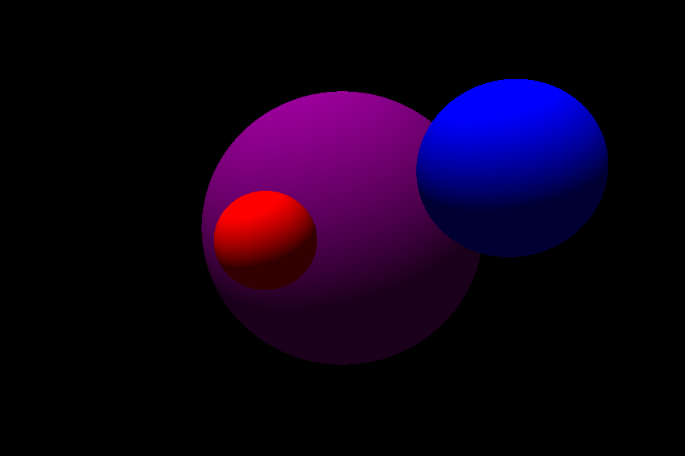

# pycon-2022-2

Talk about implementing Raytracing with numpy for PyCon Chile 2022.
Based on the tutorial "Raytracing para todos".

[Link to video presentation](https://www.youtube.com/watch?v=SyfSvvyfP8Q)
[Link to tutorial](https://sombra.studio/raytracing-para-todos)

## Usage

Install dependencies with:

`$ python -m pip install -r requirements.txt`

Run the black image example:

`$ python image_example.py`

Run the main program:

`$ python main.py`

## Dependencies

- Python 3
- numpy
- Pillow
- progress
